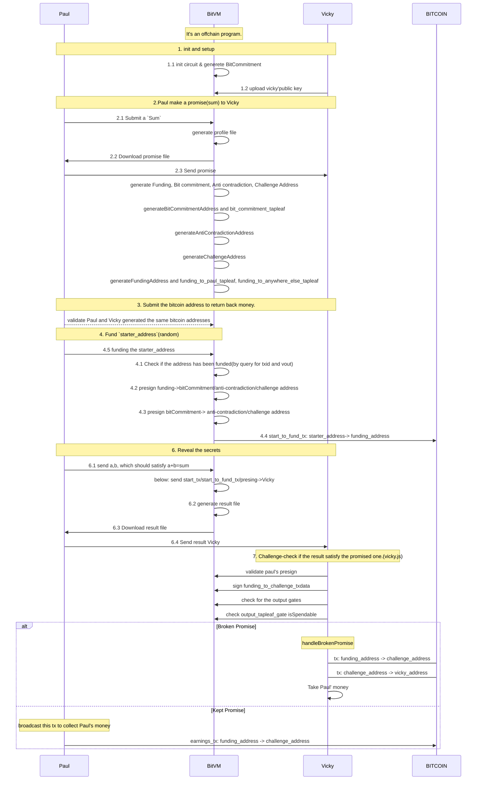

```mermaid
sequenceDiagram
  participant Paul
  participant BitVM 
  participant Vicky

  Note over BitVM: It's an offchain program.


  Note over Paul,Vicky: 1. init and setup
  BitVM ->>BitVM: 1.1 init circuit & generete BitCommitment
  Vicky ->>BitVM: 1.2 upload vicky'public key
  
  Note over Paul,Vicky: 2.Paul make a promise(sum) to Vicky
  Paul->>BitVM: 2.1 Submit a `Sum`
  BitVM ->>BitVM: generate profile file
  BitVM->> Paul: 2.2 Download promise file
  Paul->> Vicky: 2.3 Send promise
  BitVM-> BitVM: generate Funding, Bit commitment, Anti contradiction, Challenge Address
  BitVM->BitVM: generateBitCommitmentAddress and bit_commitment_tapleaf
  BitVM->BitVM: generateAntiContradictionAddress
  BitVM->BitVM: generateChallengeAddress 
  BitVM->BitVM: generateFundingAddress and funding_to_paul_tapleaf, funding_to_anywhere_else_tapleaf

  Note over Paul,Vicky: 3. Submit the bitcoin address to return back money.  
  Paul-->>BitVM: validate Paul and Vicky generated the same bitcoin addresses

  Note over Paul, BitVM: 4. Fund `starter_address`(random)
  Paul ->> BitVM: 4.5 funding the starter_address
  BitVM->>BitVM: 4.1 Check if the address has been funded(by query for txid and vout)
  BitVM->>BitVM: 4.2 presign funding->bitCommitment/anti-contradiction/challenge address
  BitVM->>BitVM: 4.3 presign bitCommitment-> anti-contradiction/challenge address
  BitVM->>BITCOIN: 4.4 start_to_fund_tx: starter_address-> funding_address


%%  Note over BitVM: 5.Broadcast the following transaction to finalize the contract
  
  Note over Paul,Vicky: 6. Reveal the secrets 
  Paul->>BitVM: 6.1 send a,b, which should satisfy a+b=sum

  BitVM->>BitVM: below: send start_tx/start_to_fund_tx/presing->Vicky
  BitVM ->>BitVM: 6.2 generate result file
  BitVM->> Paul: 6.3 Download result file
  Paul->> Vicky: 6.4 Send result Vicky


  Note over Vicky: 7. Challenge-check if the result satisfy the promised one.(vicky.js)
  Vicky ->> BitVM: validate paul's presign
  Vicky ->> BitVM: sign funding_to_challenge_txdata
  Vicky ->> BitVM: check for the output gates
  Vicky ->> BitVM: check output_tapleaf_gate isSpendable
  alt Broken Promise
     NOTE over Vicky: handleBrokenPromise
     Vicky->BITCOIN: tx: funding_address -> challenge_address
     Vicky->BITCOIN: tx: challenge_address -> vicky_address
     Vicky->>Vicky: Take Paul' money 
  else Kept Promise
    NOTE OVER Paul:  broadcast this tx to collect Paul's money 
    Paul->>BITCOIN: earnings_tx: funding_address -> challenge_address
end

```